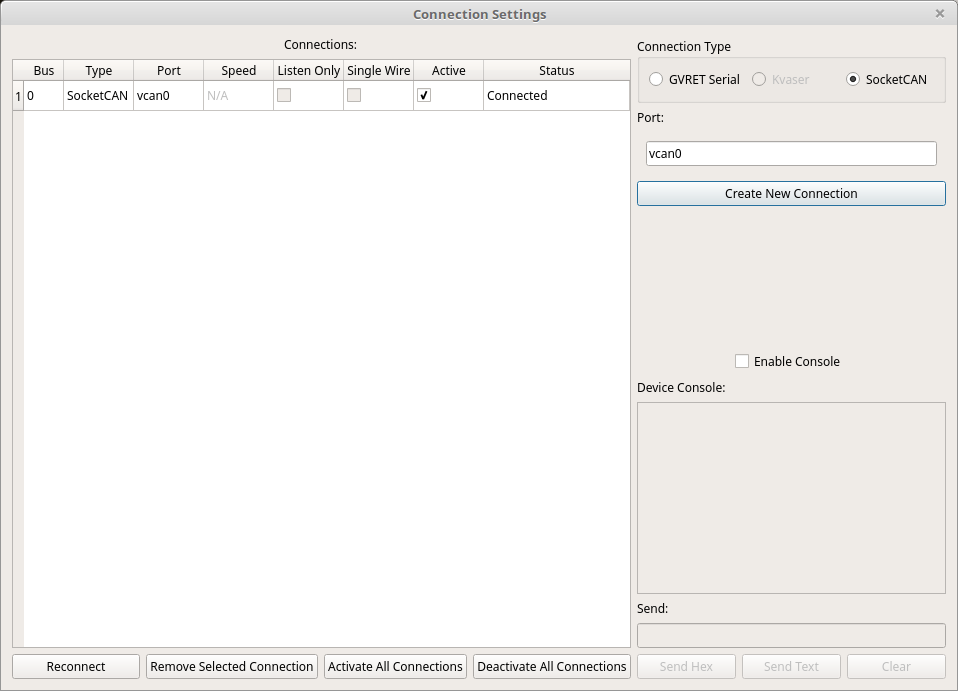

Connection Window
=============================

**Connection Management Window**

The connection window is used to add, remove, and modify connections. At the moment it is possible to use any SocketCAN compatible device (in LINUX) and any GVRET compatible device in any of the supported operating systems.
At this time GVRET compatible devices are: EVTVDue, EVTV CANDue (1.3/2/2.1/2.2), Teensy 3.1-3.6, Macchina M2.

Connecting To A Dongle
=============================

SavvyCAN is able to connect to GVRET compatible devices to capture new traffic. These devices will present as serial ports on the connected PC.
To connect to a dongle select the proper serial port and click "Create New Connection". If a valid device is found on that serial port the first
statusbar section will update and the currently set canbus speeds will show in the table at the left of the window. These speeds can then
be changed by clicking on the speed (or otherwise selecting the cell in the table) and typing in a new value. Leaving the cell will update the speed to the new value. GVRET devices also support
setting "listen only" on each bus. This mode causes the device to not acknowledge any traffic or try to modify the bus at all. It is as it says, a mode where you can only listen to whatever traffic
is found on the bus. Some older GVRET devices supported a mode where you could change the second bus between single wire CAN and normal CAN. This is deprecated. However, newer GVRET devices have
dedicated single wire CAN buses and the relevant bus will show the checkbox.

SavvyCAN can also connect to SocketCAN devices in LINUX. Select "SocketCAN" as the connection type and then type in the device name. This should be just the same as you would provide to the can-utils
programs. That is, do not enter /dev/can0 but rather can0. Then push "Create New Connection" and you should see the new connection in the table on the left of the window. Note that SocketCAN devices don't
support changing the baud rate within a program. You must do this when you set up the connection via console commands. This is outside the scope of this documentation. Consult the SocketCAN documentation
for details on configuring such devices.

Debugging Connection Problems
=============================
GVRET devices present as serial ports and have significant configuration options. However, the ability to configure so many things and the ability to compile the firmware yourself both come as a
double edged sword. They present many opportunities for things to go wrong. Because of this there is a debugging console present on the connection window. Click a bus in the table then click "Enable Console" 
to cause it to start logging serial traffic. From this console you can see what is going on. It shows what SavvyCAN is sending and what it is getting back. It has extended status messages that might help to narrow down 
what is going wrong. Additionally, if you're feeling adventurous you can send traffic to the serial device from the Send line. "Send Hex" accepts a set of hex values separated by spaces. "Send Text" will send the raw
text you type on the line. GVRET traffic is ordinarily binary so "Send Text" won't work very well for that. But, there is also a text console possible on GVRET devices. If you connect to them with a serial program you can
configure things via a text console. Type ? and follow it up with some form of line ending (Cr, Lf, CrLf, any will work).
