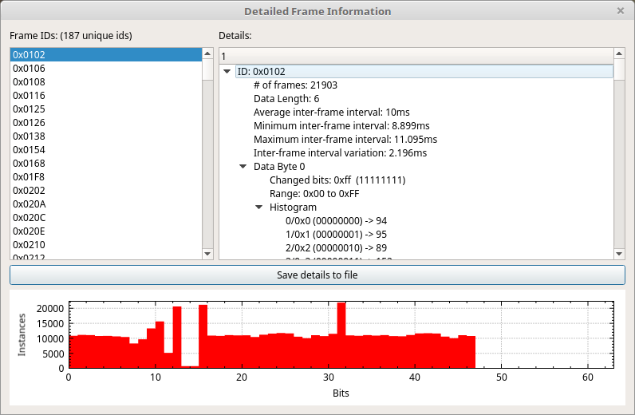

Frame Details Window
======================

.

The Purpose of Frame Details Window
===================================

This window is used to get detailed statistics about frames. It provides information about a given frame ID across all frames with that ID. You can get such information as the number of frames, the number of data bytes that frame ID has, the average interval between frames with that ID, and the minimum and maximum interval. Also listed are detailed statistics for each data byte in that frame. Each byte has listed which bits changed, the range of values found, and a histogram both graphically (at the bottom of the window) and textually. The textual representation shows the number of times a specific value occurred. Also listed at the bottom is a histogram of each bit and how many times it was set. The graph is a histogram of all the bits and the number of times each bit was set. This can be used to quickly visually see where data has changed. All information can be saved to a text file for later analysis.
