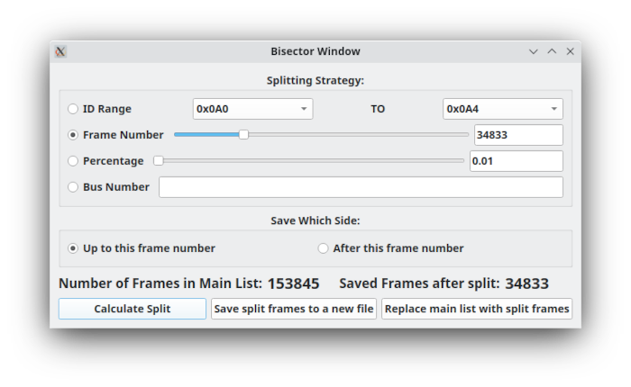

Bisector Window
=================

Using the Bisector Window
==========================

The purpose of this window is obviously to split the list of frames into two pieces. You have many options for how to do this. You can split by:

ID Range - Grab a set of frames between two values. Note that you cannot pick and choose frame IDs here but rather just use a list. If you want to pick and choose then use the filter interface on the main form and then save the filtered list from the File menu.

Frame Number - You can split right at a given frame number. All frames up to that number will be on one side with all the rest on the other.

Percentage - Pretty much just like the Frame Number option but in percentage instead in case that is more convenient.

Bus Number - You can also split the capture to include or exclude a given bus number. This can be helpful to allow breaking up the file into per-bus files.

In all cases, you have the option of which side of the split you want to save. Click "Calculate Split" to process the split. You will see above the buttons a reference of how many frames there were in total and how many you would be saving after the split. From here you *should* be able to do one of two things:

"Save split frames to a new file" - Save the new list of frames (after the split) to a file. You can save to any file format that SavvyCAN supports elsewhere. 

"Replace main list with split frames" - Erases all messages on the main window and replaces them with the results of the bisection. You will lose all discarded frames if you haven't saved them elsewhere.
