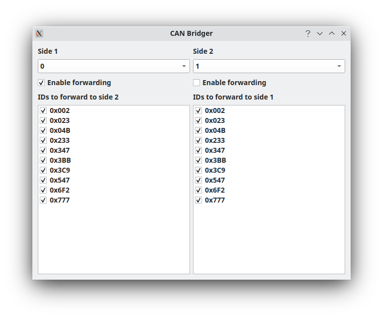

CAN Bridge Window
=================

Using the Bridge Window
==========================

The purpose of this window is simple, to allow one to forward traffic from one bus to another. Any two buses you have connected could be bridged in this way, even if they originate on different hardware adapters. By default neither side will forward to the other. You must select different buses for Side 1 and Side 2 then enable forwarding from one to the other. You can enable bi-directional forwarding. However, this can be problematic. If you are not careful you can create an infinite loop where traffic from one side gets forwarded to the other side which then forwards to the first side, and so on. 

If you'd like to only forward some traffic then uncheck the boxes next to IDs you do not want to forward.

At the moment this window is in the preliminary stages and, as mentioned above, could be prone to allowing infinite loops in some circumstances.