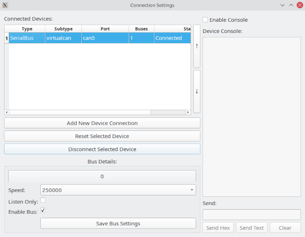

Connection Window
==============================

The connection window is used to add, remove, and modify connections.

Connecting To A Dongle
==============================
Click the button "Add New Device Connection" and fill out the screen with the proper settings. Some devices may create more than one bus but will still only take up one row in the list.

Removing a Device
==================
Click on the device in the list in the upper lefthand side of the window then click the "Remove Selected Device" button

Modifying Device Settings
=========================
Once you have selected a bus from the list you can disconnect it or modify its settings in the parameters at the buttom left. You must click "Save Bus Settings" to confirm the new settings. If the device you have selected has multiple buses then you will see tabs appear below where it says "Bus Details", one for each bus.

Debugging Connection Problems
==============================
GVRET devices present as serial ports and have significant configuration options. 
However, the ability to configure so many things and the ability to compile the firmware 
yourself both come as a double edged sword. They present many opportunities for things 
to go wrong. Because of this there is a debugging console present on the connection window. 
Click a bus in the table then click "Enable Console" to cause it to start logging serial 
traffic. From this console you can see what is going on. It shows what SavvyCAN is sending 
and what it is getting back. It has extended status messages that might help to narrow down 
what is going wrong. Additionally, if you're feeling adventurous you can send traffic to 
the serial device from the Send line. "Send Hex" accepts a set of hex values separated 
by spaces. "Send Text" will send the raw text you type on the line. GVRET traffic is 
ordinarily binary so "Send Text" won't work very well for that. But, there is also a 
text console possible on GVRET devices. If you connect to them with a serial program you can
configure things via a text console. Type ? and follow it up with some form of line 
ending (Cr, Lf, CrLf, any will work).
