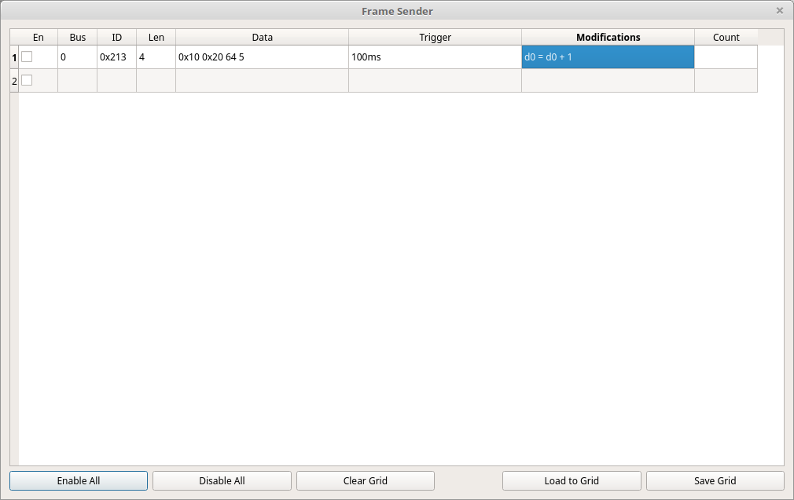

Custom Sender Window
=====================

General Overview
====================

This window allows you to create custom frames that will be sent out on one of the can buses. The uses are endless.
It can be used to generate valid traffic to control connected hardware. It can be used to test out various ideas
you might have for now to interact with other devices. It can replay frames from one bus into the other bus but with
modifications.

Layout of the View
=====================

This screen is laid out as a data grid. 

* The first field is "En" which stands for Enabled. If the checkbox is checked
  then this line will be active.
* The second field is "Bus" and sets which bus to use for sending.
* The third field is "ID" and is the ID to use for sending. It can be specified in hex or decimal formats.
* The fourth field is "Len" and sets the number of data bytes for this frame.
* The fifth field is "Data" and specifies what values will be sent for the next frame. These values can be
  automatically updated by the modifiers which will be covered later on.
* The sixth field is "Trigger" which specifies when this frame will be sent. Proper syntax for triggers is
  covered later.
* The seventh field is "Modifications" which specifies how the data bytes for this frame will be changed for
  the next frame sent. Full syntax for this is covered later on.
* The final field is "Count" and is automatically filled out with the number of frames that have been sent as
  a result of this line. 

Writing Trigger Rules
=======================

It should first be noted that each line can contain multiple triggers. Each trigger is separated by a comma ','.

Triggers are allowed to have one or more conditions. Each condition contained within a single trigger is separated
by a space ' '.

The program implements the following conditions:

* id - Set the trigger to activate when a frame with the given ID is received. The syntax is 'id' 
  followed by the numeric ID you want to match. Example: 'id0x200'
* ms - Set the number of milliseconds to wait. This condition acts differently depending on whether
  you have set ID matching as well. If so then ms will cause a delay of the requested number of milliseconds
  after receiving a frame with the ID. If not, the trigger will constantly fire every time the requested number
  of milliseconds have elapsed. The syntax is the number of desired milliseconds followed by 'ms'. For example:
  '40ms'.
* x - Only allow this trigger to fire a set number of times. The syntax is the number of times you want the trigger
  to fire followed by 'x'. For example: '100x'.
* bus - Only trigger when a frame with the given ID comes in on the specified bus. Otherwise the triggering frame
  could come from either bus. The syntax is 'bus' followed by either '0' or '1'. For example: 'bus0'

Now, a full example of a trigger line: "id0x200 5ms 10x bus0,1000ms" This trigger means: Trigger when a frame with ID 0x200 comes
in on bus 0. Wait 5 milliseconds before sending and only allow this to happen at most 10 times. Also, always trigger every
1 second and never stop doing this.

Writing Modifications
=======================

As with the triggers, you can have multiple modifications per line; each of which is separated by a comma ','.

Modifications always start with a data byte to modify The syntax is 'D' or 'd' followed by a number 0 through 7.
For example: 'D4'. This is then always followed by an equal sign '='. Thereafter there is a string of operands and
operations. 

Operands have a special syntax. Each operand can have multiple sections separated by colons ':'.

* D - A data byte. Specifies which data byte 0 - 7 from the given frame to use for this operation. If specified
  on its own it will reference the data in the "Data" section of this line. The syntax is 'd' or 'D' followed
  by a number 0 - 7. Example: 'D3'.
* ID - Instead of grabbing data from this line's data bytes grab it from the last frame received with the given ID.
  Syntax: 'ID' followed by a colon ':' followed by the ID to match against. Example: 'ID:0x200'
* BUS - Restrict which bus the frame used for grabbing the data bytes can come in on. Syntax: 'BUS' followed by
  a colon ':' followed by 0 or 1 to specify which bus to use. Example: 'BUS:0'
* <NUMBER> - Instead of using a data byte from somewhere you can instead use a numeric literal. The syntax is
  the same as any number - either a series of numbers or 0x followed by a series of numbers and A - F to specify
  a hexadecimal number. Example: 0x10.

A few full examples of operands:

* "bus:0:id:0x120:D3" = Grab byte 3 from the last frame with ID 0x120 that came in on bus 0.
* "0x200" = Use the numeric value 0x200 directly.
* "id:0x200:D7" = Grab byte 7 from the last frame received with ID 0x200.

Each operand is usually followed by an operation and then a second operand. If no operation or second operand is found that
is also OK. Thus a modifier can be as simple as "D0 = D1" if you choose. Operands can also be directly chained such that the
output of the last operation is used as the left hand operand for the next operation. This will be shown later on.

Modifiers can use the following operations:

* \+ - Add the two operands together. Example: "D1 + D2"
* \- - Subtract the second operand from the first operand. Example: "D1 - D2"
* \* - Multiply the two operands together. Example: "D1 * D2"
* \/ - Divide the first operand by the second operand. Example: "D1 / D2"
* \& - Do the bitfield operation AND on the two operands. Example: D1 & 0x20    
* \| - Do the bitfield operation OR on the two operands. Example: D1 | 0x10
* \^ - Do the bitfield operation XOR on the two operands. Example: D1 ^ 0xD2

Putting all of that together yields complete modifiers. For simplicity all operations
are done left to right. There is no special order of operations like in normal mathematics.

Here are a few examples:    

* "D0=D0+1" = Take the value in D0 within this line's data bytes, add 1, and store it back in D0.
* "D1=ID:0x200:D3+ID:0x200:D4&0xF0" = Grab byte 3 from the most recently received frame with ID 0x200 and add it 
  to byte 4 from the same received frame. AND this new value with 0xF0 and finally store it in D1 of the data bytes for this line.
* "D2=D4 * 10 + D3 & 0x3F" = Multiply byte 4 by 10, add the new value to byte 3, AND the resulting value by 0x3F and store it in byte 2.

