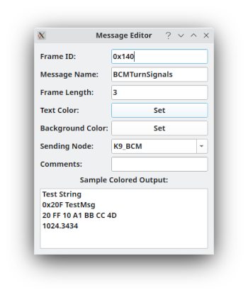

DBC Message Editor
===================

This new interface places all nodes, messages, and signals into a tree structure. Each node has a list of messages that are sent by that node. Each message, in turn, has a list of signals contained within. Multiplexed and multi-level multiplexed messages are supported. Double clicking a node, message, or signal will bring up the relevant editor.

Quick Cheat Sheet
==================
* F3 = Go to the previous item while searching
* F4 = Go to the next item while searching
* F5 = Create a new node
* F6 = Create a new message
* F7 = Create a new signal
* DEL = Delete the currently selected item (node, message, or signal)
* You can right click on nodes to get some special operations
* If you have a message selected and you create a new message it will be a clone of the selected message. Likewise for signals. 
* If you have a message selected and create a signal then that signal will have the message as its parent.
* All items have icons to help you quickly determine what they are. Nodes have triangle icons, messages have envelope icons, signals have a few different icons depending on whether they're normal signals, multiplexor, or multiplexed.

Working with Nodes
===================

In DBC files a node is a device on the CAN bus. For instance, the engine control unit (ECU) would be a node as would a motor controller, a battery charger, or any other device that is connected to the CAN bus. DBC files let you define nodes that are set as either the sender or receiver of a message. This allows messages to be organized for more easy retrieval. To add a new node click on the "New Node" button at the top or press F5 and type a new name and optionally a comment. The comment is not used by SavvyCAN but can be filled out for your own reference. The arrow next to a node can be pressed to get a list of all messages contained within.

Working with Messages
=====================

Within each node are zero or more messages. Messages are defined based on their frame ID. For normal DBC files this creates a one to one correspondence of ID to a given CAN ID. For J1939 and GMLAN messages special masking is done and so more than one actual CAN id will map to the given message ID but still only one specific J1939 PGN will come through. Once a message ID is entered in for a new message it will attempt to auto populate the Data Len column with the number of data bytes that message has. You won't be able to set signals into bits that are past the message length so care should be taken to make this value accurate. You can give the DBC message a meaningful name. You can set the text color and background color for each message. This information will be used on the main screen when you click "Interpret Frames" but can quickly back fire. If you set black on black you will have a bad time. And, making your window look like a circus might not be ideal either. However, the choice is yours!
