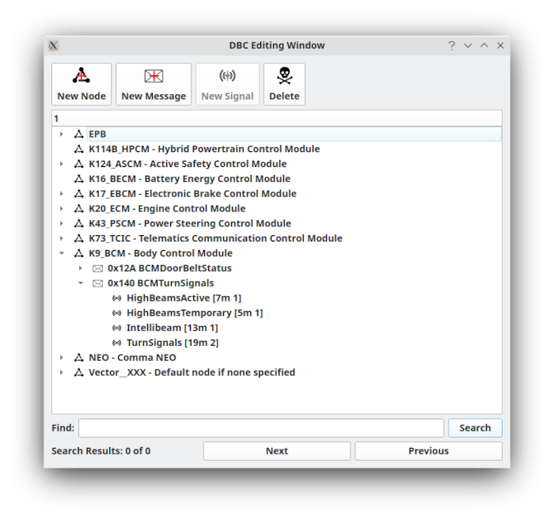

DBC Message Editor
===================

Working with Nodes
===================

In DBC files a node is a device on the CAN bus. For instance, the engine control unit (ECU) would be a node as would a motor controller, a battery charger, or any other device that is connected to the CAN bus. DBC files let you define nodes that are
set as either the sender or receiver of a message. This allows messages to be organized for more easy retrieval. To add
a new node click on the empty row beneath the last defined node and type a new name and optionally a comment. The comment is not used by SavvyCAN but can be filled out for your own reference. When a node is selected in the top list you will then see
in the bottom a listing of every message it sends.

Working with Messages
=====================

The bottom list is all of the messages that are sent by the selected node. A message is defined based on its message ID. The message ID is the CAN id used for this message. For normal DBC files this creates a one to one correspondence of ID to a given CAN ID. For J1939 messages special masking is done and so more than one actual CAN id will map to the given message ID but still only one specific J1939 PGN will come through. Once a message ID is entered in for a new message it will attempt to auto populate the Data Len column with the number of data bytes that message has. This is only for your information, it is not used by SavvyCAN. You can give the DBC message a meaningful name. The "Fg" and "Bg" columns can be clicked on to set a color. This will set the foreground and background color to use for this message. These colors will be used in the main frame view on the main screen when you click "Interpret Frames." Clicking on the "Signals" column will bring up the signals editor for that message so that you can edit, add, or remove signals from the message. The "Comments" column is once again not used by SavvyCAN and only for your viewing reference.
