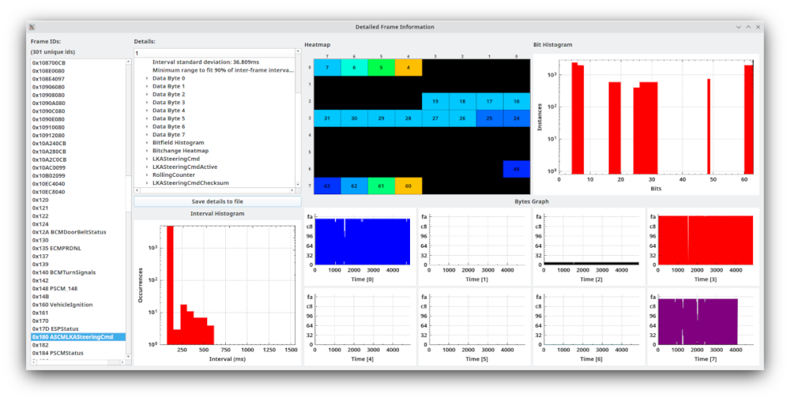

Frame Details Window
======================

The Purpose of Frame Details Window
===================================

This window is used to get detailed statistics about frames. 

It provides information about a given frame ID across all frames with that ID. You can get such information as the number of frames, the number of data bytes that frame ID has, the average interval between frames with that ID, and the minimum and maximum interval. 

Also listed are detailed statistics for each data byte in that frame. Each byte has listed which bits changed, the range of values found, and a histogram both graphically (at the right-hand side of the window) and textually. The textual representation shows the number of times a specific value occurred. 

If you have a DBC file loaded which matches the ID you've selected then you will also see details about how the various signals changed over the capture.

The top right graph is a histogram of all the bits and the number of times each bit was set. This can be used to quickly visually see where data has changed. 

The bottom right graph is of each individual byte as its value varies over time. All textual information can be saved to a text file for later analysis.

The interval histogram is in logarithmic scale and shows a listing of what intervals were seen between frames. This can be used to visually see the frame timing. Some frames get sent very regularly. They will show a very pronouced bell curve. Other frames might get sent on demand. These frames will have peaks at odd places and not conform to a nice distribution. For instance, in the picture you can see that the frame shows many frames around 15-20ms timing but some around 40, 60, and 80 as well. This might indicate the frame is not always sent or it might show that the frame is getting lost. After all, those timings are all around multiples of 20ms.
