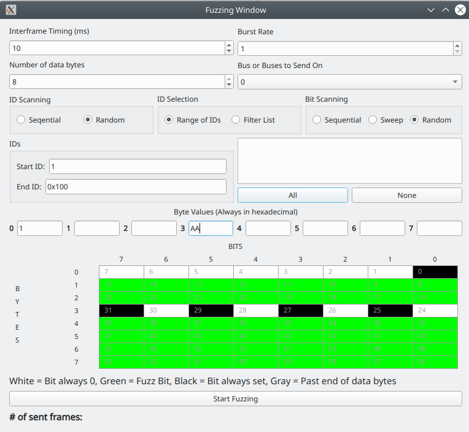

Fuzzing Window
===============

The Purpose of Fuzzing
======================

Some people are big fans of fuzzing, some people have no use for it. There usually isn't much in between. So, what is fuzzing and why would you want to do it? Fuzzing is intentionally sending random information to see what happens. It's pretty much the "shotgun" solution - you fire birdshot into the air and see if it hits anything. Does that sound a bit dangerous? It kind of is. So, why do it? It might help you to find frame IDs that control things. It might help you to find a data byte that controls something. Used carefully it can be used to figure out how different values affect things.

Fuzzing is Dangerous
====================
You have now been warned. Sending random garbage over the CAN bus to see what happens could mess something up. It just might put your vehicle into gear and cause you to drive over a box full of kittens. Be careful! Never fuzz a car unless you're right there and you can stop it. Even better, don't do it unless your car is up on a hoist or jacks and can't drive over anyone. Even still, there is a small chance you could cause an adverse effect to your car. If you break something you own the pieces.

Controlling the Fuzzy Beast
===========================

So, you want to give it a try? Let's do it! First of all, you can set the delay between frames and the burst rate. The delay is in milliseconds but can be set as low as 0. If the delay is set to 0 then the system will attempt to send frames as fast as it can. However, even then you may not get quite as many frames per second as you'd like. Even at 0 it will still be scheduled by your operating system and so might not quite get to the speed you want. The burst rate can cause the program to send more than one frame each interval. This is useful as a CAN bus could potentially support 2000 to 8000 frames per second. If you need rapid frame sending your best bet is to set the sending interval to 1-2ms and then adjust the burst
rate until you get your desired sending rate. Then you can set the number of bytes to send. Ordinarily this would be the full 8 but you can experiment with smaller frames. You can set to send on a specific bus. That's all the simple settings. It gets a bit more complicated now.

The "ID Scanning" box has two radio buttons:

1. Sequential will go from "Start ID" to "End ID" then reset back to Start over and over.
2. Random will pick IDs at random in the range between Start and End

But, perhaps you don't want to fuzz IDs like that? The next box is "ID Selection" and the choices are:

1. Range of IDs - this uses the aforementioned Start and End IDs
2. Filter list - This causes it to pick frame IDs from the list below either sequentially or randomly according to the radio boxes under "ID Scanning"

The last box is "Bit Scanning"

1. Sequential causes it to scan bits in logically sequential order. That is, the first available fuzzing bit is set then the just the second, then the first two, etc. This causes all of the fuzzed bits to sequentially set in order.
2. Sweep causes the system to set the first one, then unset that one and set the second bit, then unset that, etc. Thus the fuzzed bit sweeps and only one fuzzed bit is set at once.
3. Random will randomly pick whether each fuzzed bit is set or not.

In order to fuzz bits you need to set which bits to fuzz and which not to. As listed at the bottom of the window, there is a color code to the 8x8 grid. Clicking cells in the grid will toggle them between their various values. White bits are never set, black bits are always set no matter what, green bits follow the fuzzing pattern you specified in "Bit Scanning" You can also set the bytes directly with the text boxes above the 8x8 grid. Setting a hexadecimal value in these
boxes will set the relevant bits in the 8x8 grid. You must press the ENTER/RETURN key to set the values. Merely changing the value will not update it (as a safety measure).

Pulling the Trigger
===================

Once you've configured everything click "Start Fuzzing" to give it a shot. You will see the number of frames sent so far listed below the button. Approximately four times per second the current value for each byte is copied into the text boxes just above the 8x8 grid. This can be used to see what is going on and to ensure that it is working the way you want it to. You can stop the fuzzing by pushing the start button again.
