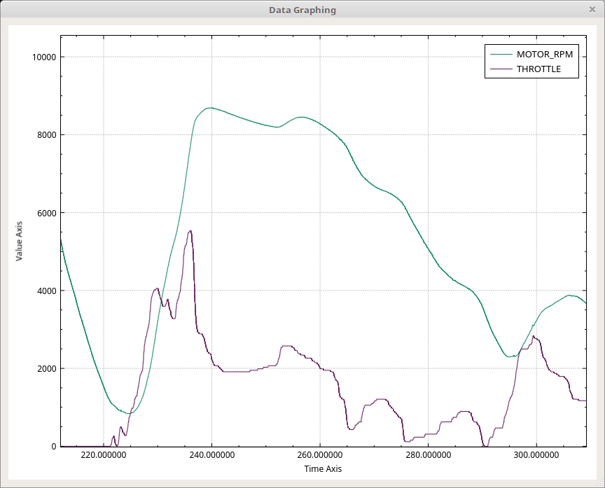

Graphing Window
===============

Creating a new Graph
=====================
Right click in the graph window to bring up a popup menu. The last entry in the first section is "Add new graph". This brings up the Graph Setup Window. From there you can create a new graph. 

Selecting a Graph
=================

You can select a graph either by clicking on it or by clicking its name in the list of graphs up that the top right.

Editing a Graph
=================

You can either double click its name in the list of graphs at the top right or select the graph, right click, and select "Edit Selected Graph"

Deleting Graphs
================

There are two options. You can select a graph, right click, and select "Remove selected graph" or you can right click and select "Remove All Graphs"

Moving Around
==============

Left clicking and dragging in the graphing area will allow you to pan around. The mouse wheel (if you have one) will let you zoom in and out. If you select the numbers on either the X or Y axis then you'll be able to pan and zoom on just that axis leaving the other alone. This is useful in order to expand or shrink the time axis or to rescale the vertical axis to better fit the data in view. The "+" key will zoom in, the "-" key zooms out. You can also zoom in and out from the pop up window that appears when you right click. If you've messed up your view and can't figure out how to fix it then right click and select "Reset View" to get a nice view of all the data again. 

Loading and Saving Graphs
=========================

It can be beneficial to create a set of graphs that can be used over and over. You can save the currently setup graphs to a file and then load it later. Right click on the graphing window and use "Save graph definitions to file" and "Load graph definitions from file" to do this. You can also save a picture of the graphing window. PDF, PNG, and JPG are supported. Lastly, you can save a spreadsheet of all the graphed points. 

Real Time Graphing
===================

Sometimes it is useful to graph while data are still being captured. When this is done it is additionally handy if the view follows the new data. In the right click pop up menu you will find "Follow end of graph". It is a checkbox. When it is on the current view will follow the end of the data captured. The "window" you've set up will scroll. That is, the zoom and vertical calibration will stay the same and only the "Time Axis" will scroll such that the end of the capture is always at the right hand side of the graphing window.

Hidden Tricks
==============

If you double click on a graphed line the main window will scroll and the frame that produced the nearest data point to where you clicked will be selected. Additionally, if you selected "Synchronize Windows" in Flow view then the graphing view will synchronize to Flow view as well.
