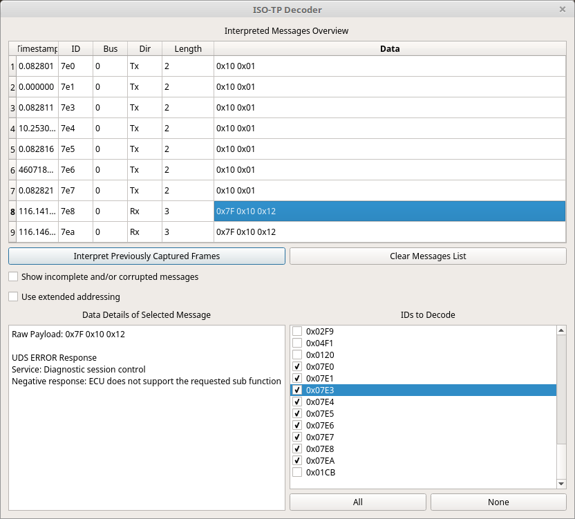

ISO-TP Decoder
===============

Using the ISO-TP Decoder
==========================

This window scans the existing captured frames and newly captured frames to see if it can find CAN traffic that seems to conform to the ISO-TP standard. ISO-TP is used to send multi-frame messages and as an encoding standard that forms the base for other protocols such as UDS and ODBII (which is essentially itself a subset of UDS). 

The main list at the top shows any messages that seem to conform to ISO-TP. There will very likely be messages here which aren't really ISO-TP. You can deselect IDs that seem to generate false positives so that they quit showing up in this list. As you can see in the picture only the ids 0x7E0 through 0x7EA were selected. These IDs are standard for UDS communication. If you want to immediately recalculate the results to exclude the deselected IDs then push "Interpret Previously Captured Frames" to regenerate the whole list. Otherwise the effect of changing the ID selections will only happen for newly captured frames. 

The "Show incomplete and/or corrupted messages" checkbox will cause a lot of false positives and should only be used as a last resort if you suspect that you might have some dropped traffic. 

"Use extended addressing" will cause the decoder to assume that extended addressing is being used on this CAN bus. Extended addressing adds an additional byte of addressing that is found in the data bytes of the frame. This isn't that commonly used but is used on some vehicles and ISO-TP decoding won't work properly unless this setting is correct. If you find that decoding seems to have failed you might try toggling this setting to see if it helps. Remember to click "Interpret Previously Captured Frames" to recalculate things for previously captured traffic.

Once you have messages in the table at the top of the window you can click on a message to get more details about it in the text box in the lower left. In the picture you can see that 0x7F 0x10 0x12 was interpreted as a UDS error response saying that the ECU does not support the requested sub-function passed to the diagnostic session control service. This is much easier than trying to remember what all those bytes mean off the top of your head!
