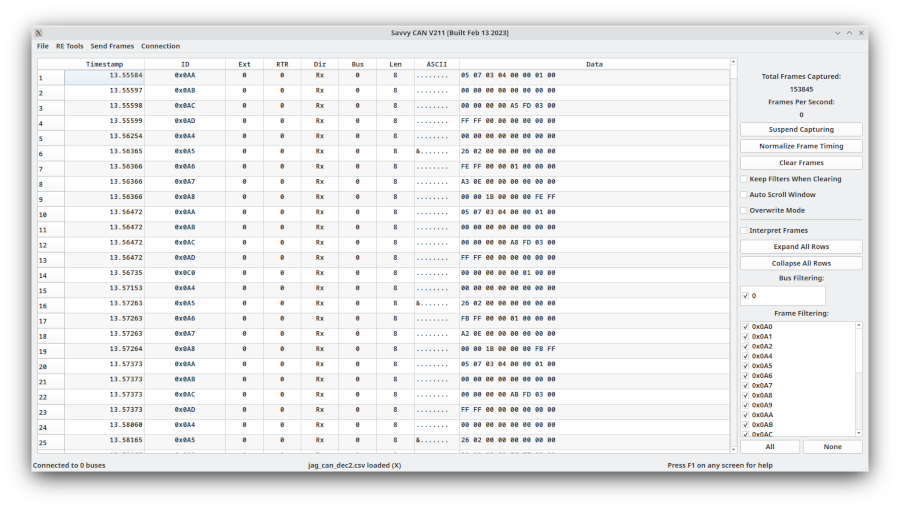

Main / Start Up Screen
======================

This screen embodies the core of the program. Here you will find the master list of all frames. Also, here you can navigate to the other aspects
of the program. You can have multiple sub-windows open at once - in fact, quite often this is very beneficial.

The Main Frame List
====================

The main frame list takes up the majority of the main screen. This list consists of the following sections:

- Timestamp: The timestamp is either in microseconds or seconds. This is a setting in preferences. Either way, the timestamp can have microsecond resolution. The difference is just whether there is a decimal point or not. GVRET has the ability to maintain full microsecond resolution for timestamping purposes. There is a third timing mode where the timestamp can be customized and is based upon the actual "clock" time.
- ID: The ID is specified either in hexadecimal or decimal (a preference you can set). This is the message identifier sent over the CAN bus.
- RTR: 0 = Standard Message 1 = Remote transmit request. An RTR frame merely asks a node to send a message, it has no payload of its own.
- Ext: 0 = Standard message (11 bit ID). 1 = Extended message (29 bit ID)
- Dir: Either "Rx" or "Tx" to show whether SavvyCAN has received or sent this message.
- Bus: SavvyCAN supports a variety of capture hardware. GVRET compatible devices can support more than one bus. The bus a frame came in on
  is specified here. Many file formats do not specify bus and thus all frames will be loaded as bus 0.
- Len: The number of data bytes that were sent with this frame. It can range from 0 to 8.
- ASCII: A character based view of the CAN bytes in ASCII characters. Many systems that send serial numbers or VIN numbers will send them in ASCII and these will thus be visible here.
- Data: All of the data bytes separated by spaces. Can be in either hexadecimal or decimal (preference). If "Interpret Frames" is checked you will
  also see extra data at the end of any frames that have DBC data. To see the rest of this data click upon the frame in the list. It will automatically expand to show all signals attached to that frame.

The Bottom Statusbar
====================

At the very bottom of the main screen is a status bar with three sections. 

* The first section shows the connection status. You will see the number of currently connected buses here.
* The second section shows which file is currently loaded. This is updated by loading or saving.
* The third section reminds you that F1 will bring up help. Most all screens have their own help.

The Rest of the Main Window
===========================

To the right of the main frames list is an area that shows the total number of captured frames and the frames per second. Total frames might not match the number of shown frames. If you've deselected any IDs in the filter list then fewer frames will be shown. Frames per second is calculated as an average and so will wind up or down when there is a sudden change.

Suspend Capturing / Resume Capturing is a button that will temporarily disable frame capture or re-enable it. This can be used to keep everything connected without capturing traffic for a short time. This can help to not capture traffic in between tests.

The "Normalize Frame Timing" button is used to reset the lowest timestamp to "0" and offset all other timestamps accordingly. This is useful to remove the starting offset when you start up a device long before actual traffic starts. SavvyCAN is designed such that this doesn't really matter most of the time but normalizing the timing might be useful to help correlate the timing between two different captures.

The "Clear Frames" button will erase all captured messages. They will be irreversibly erased and all memory will be freed.

The "Auto Scroll Window" checkbox will cause the main frame list to hunt toward the bottom of the list as frames come in. It will normally not be quite
at the very bottom as, for performance reasons, the program runs at quarter second updates to things like the auto scroll. Thus, the main list will be
scrolled to the bottom four times per second.

The "Interpret Frames" checkbox is used to specify whether the loaded DBC file should be used to interpret all available messages and signals. One might want
this off for performance reasons (interpreting takes some extra processor power and RAM) or to declutter the main frame list.

The "Overwrite Mode" checkbox is used to ensure that only the newest frame for each message ID is shown. That is, if 100 messages with ID 0x105 come in you
will see only the newest one. This is generally used alongside "Interpret Frames" to interpret frames and always see the up-to-date information.

"Expand All Rows" will expand all the rows to show every signal in every message. This will take a **VERY** long time if there are many messages loaded. Because of this, you may receive a warning if the program determines that this will take an excessive amount of time to complete. You can make it work faster by filtering away any unneeded messages.

"Collapse All Rows" will drop all rows back to taking up only one line. This can also take a while to run and will also warn if the operation seems like it will take a very long time to complete.

"Bus Filtering" allows for messages to be shown or hidden based on which bus they came in on.

"Frame Filtering" provides a list of all the frame IDs seen so far. Any ID which is checked will be shown in the main list. Any ID which is unchecked will not.
This can be used to hone in on frames of importance while hiding frames that are currently of no interest. The filtered list can be saved as well.

Loading And Saving Frames
=========================

What CANBus analysis tool would be complete without an easy way to load and save frames? 

SavvyCAN can load and save in several formats (a few of which are listed below):
	- CRTD: This format was made by Mark Webb-Johnson for OVMS (open vehicle monitoring system) and other related tools. It is a reasonably readable and compact format.
	- GVRET: This is the native format for GVRET and SavvyCAN. The GVRET format saves more information such as the bus a frame originated on. This format is in CSV 
	  (comma delimited) format and as such can easily be loaded into your favorite spreadsheet program as well.
	- Generic ID/DATA - Another CSV format. This is a very cut down format with limited information.
	- BusMaster - This is the format output by the BusMaster CANBus program. BusMaster is an open source Windows-only somewhat clone of CANAlyzer (the 800lb gorilla in the analysis space). The ability to load and save in this format makes SavvyCAN fully capable of swapping data with BusMaster should you need to do so.
	- Microchip - Format output by Microchip CANBus tools. Perhaps you have logs that were captured with a $100 Microchip dongle? You can load them in SavvyCAN.

There are many other formats supported. Some are only supported for writing, some only for reading. The list of supported formats is expanded every so often.

Filters
========

You might notice that there are three entries in the file menu that mention filters. SavvyCAN can filter messages so that you only see some of the messages coming in on the bus. It still saves all incoming messages but you are able to filter which you will view at any given time. 
SavvyCAN allows for loading and saving the list of frames you'd like to view so that you can easily switch "sets" of frames to view. Also, when saving you can optionally save just the frames that you have filtered instead of every captured frame. Filters are set in the lower right-hand of the this screen. All IDs are selected by default. To deselect an ID click on the checkbox next to it. You can also deselect all IDs or select all IDs. These are useful if you only want to view a couple of IDs (click None then the few you need) or you just want to remove a couple (click All and then deselect the ones you don't care about).

What is DBC and why would I care?!
==================================
	
I'm glad you asked. DBC is a file format used to specify how "signals" are stored in "messages." A message is essentially a unique packet of data sent on the CAN bus. Ordinarily this message is differentiated by frame ID. Each ID is a different message (usually). A signal is a piece of data stored in a message. For instance, ID 0x105 might be a message from the vehicle control unit to the motor inverter. Within that message bytes 0 and 1 might encode the desired torque. That would be a signal. A DBC file allows these relationships to be specified and named. It also allows for scaling of values stored in a signal. Additionally, a signal can have values associated with textual output. For instance, if a signal encodes the current gear then a DBC file can define that a value of 0 means "Park" and a value of 1 means "Drive". This makes analysis a lot easier since you do not need to remember the mapping yourself. In this way data can be better understood by users of the program. Also, other windows can use the DBC file for such things as being able to graph a signal without having to figure out the actual details of that signal.

How DBC interacts with the main screen?
=======================================
	
First of all, one can load and save DBC files from the "DBC File Manager" found in the File menu. Also in the File menu it is possible to save the currently loaded frames but with DBC decoding. This is somewhat like the normal saving functionality with a two differences: there is only one output format and that format has all signals contained in each message listed and decoded.
