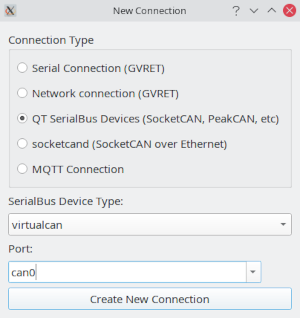

Adding a new connection
========================

At the moment it is possible to use any QT SerialBus compatible device and any GVRET compatible device in any of the supported operating systems. SerialBus supports socketcan on linux, passthrough on Linux and Windows 32 bit, and Vector, PeakCAN, and TinyCAN on supported OS's.

At this time GVRET compatible devices are: EVTVDue, EVTV CANDue (1.3/2/2.1/2.2), 
Teensy 3.1-3.6, Macchina M2, Macchina A0, EVTV ESP32 Due.

You can also use a variety of network based connections to gain access to remote capture hardware.

Connecting To GVRET Devices
==============================

SavvyCAN is able to connect to GVRET compatible devices to capture new traffic. These 
devices will present as serial ports on the connected PC. To connect to a dongle select "Serial Connection." This will bring up a list of serial ports on the machine. Select the proper one and then press "Create New Connection". This will close the window and bring you back to the connection manager window. If connection succeeds the status will show "Connected" for your newly set up device.

You can also connect to some GVRET devices over the network (A0, EVTV ESP32Due). These devices broadcast their address. Once you've selected "Network Connection (GVRET)" you should see a list of IP addresses that appear to have GVRET devices on them. You can also manually enter the proper IP address but if the device did not automatically register itself it is unlikely to work with a manual entry either.

Connecting to QT SerialBus Compatible Devices
=============================================

SavvyCAN can also connect to a wide variety of CAN hardware through the built-in QT
SerialBus drivers. These drivers vary by operating system but support socketcan on LINUX
and Vector tools on both LINUX and Windows. When you select "QT SerialBus Devices" you will
get a list of device types supported. Select a device type and for most devices you should see
the Port list fill out with all registered and valid ports for that driver. Socketcan devices, for
instance, are automatically detected now. Then push "Create New Connection" and you should 
see the new connection in the table on the left of the window. Note that SocketCAN devices 
don't support changing the baud rate within a program. You must do this when you set up 
the connection via console commands. This is outside the scope of this documentation. 
Consult the SocketCAN documentation for details on configuring such devices.

QT also includes a "virtualcan" device type. You can use this to create a bus that will loop back anything you send to it. This is useful for testing without needing to connect any devices or load any log files.

Connecting to Socketcand
========================

This is a LINUX only solution which allows one to connect to a socketcan device that is registered on the local network. You can also set up SSH tunnels or VPN to expand the reach over the internet. It should fill out a list of any available socketcand interfaces. Setting up socketcand is outside the scope of this help file but may your GoogleFu be strong.

Connecting over MQTT
====================

Lastly, it is possible to connect to an MQTT broker to send and receive CAN traffic over the internet. This is much like socketcand but more cross platform and also supports easy broadcasting. For instance, for capture the flag events, it would be possible to connect the device over MQTT and have multiple participants and/or watchers all connected at once. Connection to the MQTT broker is set up in the main SavvyCAN preferences. In this window you merely select the topic name to subscribe to. There is currently no automatic way to list these topics so you will need to know the topic to subscribe to ahead of time. It should be noted that the bidirectional nature of this interface means that everyone is on equal footing. You can create an MQTT interface that others can connect to or you can connect to a topic that is currently being sent to from elsewhere and get the traffic. Additionally, the SavvyCAN source code at GitHub has a python script which can be used to connect a socketcan interface to MQTT. You can use this script on a remote system to connect it to the internet so that you can run SavvyCAN somewhere apart from the device under test.
