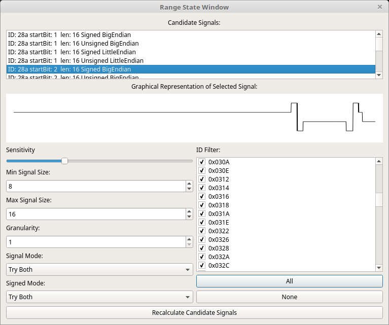

Range State Window
===================

Using the Range State Window
============================

The purpose of this window is to search for signals that look like they might be important. That's a rather nebulous description. But, the idea is to find signals that seem to vary somewhat coherently. As you can see in the picture in this help, the displayed signal has some jumps but they look like they might "be something." That's the idea. It *will* generate a lot of false positives but it will still provide some decent ideas for where to look for signals. It is up to you to figure out if the signal is anything important or anything you can use.

To use it first set up the follow things:

1. The ID Filter list - Deselect any IDs you don't want to search.
2. Sensitivity - This is a subjective measurement. It doesn't affect the results a lot but changing this value back and forth can alter what the program thinks is a relevant signal.
3. Min Signal Size - The smallest signal you want to search for. You can search for signals all of the way down to 1 bit if you're feeling adventurous.
4. Max Signal Size - The largest signal you want to search for. The range between Min and Max changes how long the process will take. If you set Min to 8 and Max to 16 then it will search for signals with 8, 9, 10, 11, 12, 13, 14, 15, 16 bits. You will get duplicates as the same basic set of bits will be used for all of the sizes.
5. Granularity - Sets the bit jump width. What is bit jump width? The number of bits that we move over each time we search for a new signal. If you have a granularity of 1 and a minimum signal width of 8 then it will search starting at bit 0 for an 8 bit message then starting at bit 1 then bit 2, etc. If you set a granularity of 8 then it will search for an 8 bit signal at bit 0 then search at bit 8, then 16, etc. So this sets how finely we will search for signals. A lot of times signals will be found on byte edges so a granularity of 8 will cause all signal searches to start on byte boundaries and this will be OK for many things. But, some designers are more devious and place signals at uneven boundaries. You might need finer granularity to find such signals.
6. Signal Mode - For signals over 8 bits there is a choice to make. Signals over 8 bits can be either in big or little endian mode. This relates to whether bit 0 of a signal is the highest or lowest value. You can search for only big endian signals, only little endian, or try it both ways. *Usually* the developer of a CAN device will stick to one or the other but not always.
7. Signed Mode - Likewise, any signal over 1 bit could be either unsigned or signed. Signed signals have their highest bit as 1 for negative numbers and 0 for positive numbers. You can search for only unsigned signals, only signed, or try it both ways. There really isn't any rhyme or reason for when a signal would be signed or unsigned. It could easily be both ways so unless you're sure it's probably safest to allow the program to try it both ways and you can pick which looks best.

Once you've got it all set up click "Recalculate Candidate Signals." Be prepared to wait depending on what options you selected. Once it is done processing you'll get a list of candidates in the upper list labeled "Candidate Signals." Here you can see all of the signals it found. You get the ID, the starting bit (remember, bits start at 0 and go through 63), the length, and whether it was signed/unsigned and big/little endian. If you click on or otherwise select a signal in this list then a graphical view of it will appear in the graphing area beneath. You might try the arrow keys Up and Down to move through the list. You can even hold down the arrow key and let it rapidly scroll. As it scrolls through the signals you can look at the graph and stop when you see a signal that catches your eye. This is useful as you can have hundreds of candidates and it is tedious to view them explicitly one at a time.

This window is handy for quickly finding signals if you know what the shape should be. For instance, vehicle speed is pretty easy to recognize. You can't go from 0 to 100 in an instant so speed tends to have a lot of sweeping motions up and down. Thus, being able to quickly see the signals makes it easy to find things that look like they "could" be speed. It might be vehicle speed in km/h, it might be mph, it could be wheel RPM. But, being able to see the graphs at a glance helps to narrow down the possibilities.
