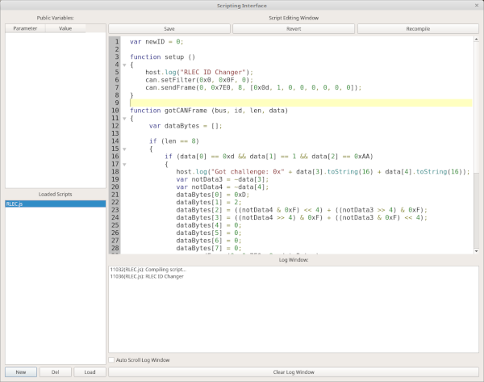

Scripting Interface
====================

Purpose of the Scripting Interface
==================================

To give you an open ended place where you can write JavaScript files that do whatever you need them to do. You can load several files at once and they'll all work at the same time. Scripts can expose parameters that can then be edited by you while the program is running. They also update 4 times per second so they can be used to give feedback of the current state of the script as well. But, it is safer to give status in the "Log Window" instead. However, for values that might need to be seen and frequently updated it might be easiest to show them as "Public Variables".

Managing Scripts
=================

In the bottom left is the "Loaded Scripts" list. You can create a new script by clicking the "New" button below the list. The new script will have a random name until you save it. The "Del" button will delete the currently selected script but it will ask you first. The "Load" button will load a new script from a file. The "Save" button is above the main script view which is in the upper right of the window. "Revert" will revert the script to the last version that was compiled. Any changes you've made since compiling well be reverted. "Recompile" is used to compile the script and begin running the new version.

Getting Script Status
======================

There are two places you can look for the status of a script. The "Log Window" is directly below the script source code editor. This window is shared between all scripts and shows the status of compiling scripts as well as log messages from each script. The script name that sent the log message is prepended. The number before the script name is the amount of time the scripting window had been open for when the message was sent. This unified interface can be used to keep an eye on all of the running scripts and to debug issues when a script is compiled. Any compile errors will show up in the log window. You can set the checkbox on "Auto Scroll Log Window" to make it continue to stay at the bottom of the log. You can clear the log at any time as well.

The other way to see script status is to use the "Public Variables" interface. Here you will find variables that were registered by the current script. Each script has its own list so information that needs to be updated frequently and/or specific to a script and easily accessible should be registered here. But, public variables can have their value set by you, the user, as well. So, care should be taken not to edit variables used for script feedback and scripts shouldn't try to change the value of variables used for input to the program.

Writing Scripts
================

You are more or less free to write JavaScript scripts but, of course, you aren't in a web browser so browser specific functions are just not there. In their place are a couple of JS objects that allow the script to interface with the CAN buses connected to SavvyCAN. Also, certain functions can be created to automatically register callbacks.

Callback Functions
===================

These functions can be created in your scripts to enable certain functionality:

setup () - If you create a function named setup then it will be called as soon as the script starts. Yes, you probably could just dump code into no function at all right into the file but that's bad form!

tick () - If you registered to receive a periodic tick within your setup function then the script interface will call this function for every tick. You can do whatever you need to periodically do here. But, you get only one tick handler so if you need multiple tick rates you'll have to create a fast tick here and dispatch from this function at different rates yourself.

gotCANFrame (bus, id, len, data) - A callback that will be called whenever a CAN frame comes in that you've registered for. You did register for frames in your setup function didn't you? Well, if you use one of the below callbacks you might not need this one.

gotISOTPMessage (bus, id, len, data) - If you are instead looking for ISO-TP messages (which could have been multiple CAN frames in length) then you can create this function and it will automatically be registered with the system. But, you still will need to set which ISO-TP message IDs you want to receive. That is covered later on.

gotUDSMessage (bus, id, service, subfunc, len, data) - UDS messages are transmitted over ISO-TP but with additional structure. If you're looking to interface directly at the UDS level then you can create this function to have it automatically registered. As with raw CAN and ISO-TP you still need to specify which messages IDs you are interested in.

The host Object
================

The first object you can use is "host" This object handles setup of the tick timer as well as logging output and registration of public variables.

host.setTickInterval(interval) - If the interval is more than 0 then your tick callback will be called every "interval" milliseconds. If a value of 0 is passed then the tick timer will be stopped.

host.log(text) - Send text to the log window. It will be timestamped, marked according to which script sent it, and placed into the log window.
   
host.addParameter("variablename") - Add the named variable to the list of public variables. From then on any changes that you make in the GUI will immediately show up in the script and any changes the script makes to a value will reflect in the GUI within 250ms. Remember to use quotes around the variable name. You want to pass the variable name, not its value.

The can Object
===============

This object is your interface to raw CAN. It has the following functions:

can.setFilter(id, mask, bus) - register to receive messages based on an ID, Mask, and Bus. It works like this. First the bus is compared. If it doesn't match the frame is not delivered to you. Then, the incoming frame has its ID ANDed with your mask. Let's say your mask is 0x7F0 and the incoming frame has an ID of 0x235. 0x235 AND 0x7F0 is 0x230. This value is compared to the ID you passed. So, if your filter ID is 0x230 then the frame is accepted and you will get a callback with the frame. Otherwise the frame is not delivered to you. This masking setup is very common in CAN bus interfaces. Basically, the mask allows a single filter to accept a range of IDs. 0x7F0 would accept 16 different IDs (0x230 through 0x23F in this case). 0x700 accepts 256 different IDs, etc. 
    
can.clearFilters() - remove all filters and revert to a clean state. You will no longer receive any CAN callbacks unless you create more filters with setFilter.
    
can.sendFrame(bus, id, length, data) - Send a CAN frame out the given bus. The CAN id will be what you set as will the length. The length can thus be different from the actual length of "data" which should be a valid javascript array. The length can not exceed 8. The frame will be sent as soon as possible so long as that bus is connected and not in listen only mode.

The isotp Object
================

isotp.setFilter(id, mask, bus) - Exactly like the raw CAN version in the can object. Allows you to register a filter so that you can receive ISO-TP traffic from the filtered addresses. It should be noted that you'll essentially only get traffic that seems to be able to be turned into ISO-TP traffic. Any CAN frames obviously not ISO-TP will be rejected.

isotp.clearFilters() - Clear all ISO-TP filters and no longer receive ISO-TP traffic.

isotp.sendISOTP(bus, id, length, data) - As in the can version. The difference here is that ISO-TP messages can be longer than 8 bytes and so might get turned into a multi-frame set of messages with flow control. This is handled for you by SavvyCAN so you needn't handle of the details of the exchange.

The uds Object
===============

uds.setFilter(id, mask, bus) - Exactly like the other two setFilter functions. Register for a set of IDs to be interpreted as UDS (if possible) and sent through to your callback. Any obviously not UDS traffic will be discarded.
        
uds.clearFilter() - Remove all filters and quit receiving UDS traffic.
    
uds.sendUDS(bus, id, service, sublen, subfunc, length, data) - Sends a UDS message out from the script. service must be between 0 and 255, subfunc can be larger than one byte if needed. data is only needed for extended payloads as the actual UDS protocol is handled by the service and subfunc parameters. 

A full example script
=====================
::

    var newID = 0; //set this to the ID you want your RLEC to become

    function setup ()
    {
        host.log("RLEC ID Changer");
        can.setFilter(0x0, 0x0F, 0);
        can.sendFrame(0, 0x7E0, 8, [0x0d, 1, 0, 0, 0, 0, 0, 0]);       
    }

    function gotCANFrame (bus, id, len, data)
    {
         var dataBytes = [];

        if (len == 8)
        {
            if (data[0] == 0xd && data[1] == 1 && data[2] == 0xAA)
            {
                host.log("Got challenge: 0x" + data[3].toString(16) + data[4].toString(16));
                var notData3 = ~data[3];
                var notData4 = ~data[4];            
                dataBytes[0] = 0xD;
                dataBytes[1] = 2;
                dataBytes[2] = ((notData4 & 0xF) << 4) + ((notData3 >> 4) & 0xF);
                dataBytes[3] = ((notData4 >> 4) & 0xF) + ((notData3 & 0xF) << 4);
                dataBytes[4] = 0;
                dataBytes[5] = 0;
                dataBytes[6] = 0;
                dataBytes[7] = 0;
                can.sendFrame(0, 0x7E0, 8, dataBytes);
            }
            if (data[0] == 0xd && data[1] == 2 && data[2] == 0xAA)
            {
                host.log("Passed security Check!");
                dataBytes[0] = 4;             
                dataBytes[1] = 0x15;
                dataBytes[2] = newID;
                can.sendFrame(0, 0x7E0, 8, dataBytes);
            }       
            if (data[0] ==4 && data[1] == 0x15 && data[2] == 0xAA)
            {
                host.log("ID Reprogramming Successful!");
            } 
        }
    }

