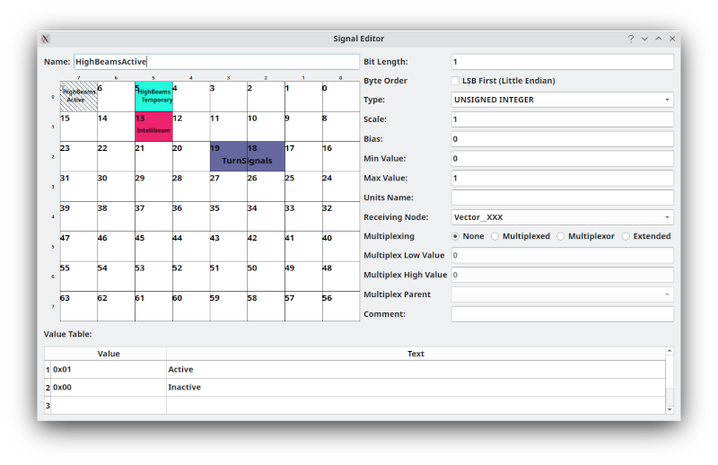

DBC Signal Editor
=================

Defining and Editing Signals
============================

On the right side you can rename the signal and you'll see that it is renamed in the DBC window as well. 

"Bit Length" - This sets how many bits the signal uses. Once you do this you'll see that that many bits are now highlighted in the 8x8 data grid above. The black bit is the "start" bit, green bits are the other bits in the signal. Gray bits are already used by another signal. You can still use them for the current signal too but doing so would be quite unusual unless you have multiplexed signals. 

"Byte Order" - The way that the green bits are filled out is changed by this checkbox. Checking it selects little endian mode whereas deselecting chooses big endian mode. This will have an effect on any signal that crosses byte boundaries. The simplest explanation is that little endian signals start at the start bit and then go "down" in bit numbers while big endian mode goes "up."

"Type" can be:
1. UNSIGNED INTEGER - No sign bit, only positive numbers
2. SIGNED INTEGER - The top bit is used as a sign bit
3. SINGLE PRECISION - Floating point number (should be a 16 bit signal)
4. DOUBLE PRECISION - Floating point number (should be a 32 bit signal)
5. STRING - Directly turn the CAN bytes into a string

It should be noted that this pertains **ONLY** to the way the signal is encoded within the CAN frame itself. Signals encoded as integers can still take fractional values because of scaling.

"Scale" is used to multiply the signal by the value to scale it appropriately. This could turn an integer into a "real" number instead. For instance, if the signal is in 0.002V increments then the scale would be 0.002 and a value of 48 stored in the CAN frame will be multiplied by 0.002 and end up as a value of 0.096.

"Bias" is added to each value generated by the signal to set it at a different bias point. Think of this as the value the signal will report if the encoded value from the CAN frame was 0.

"Min Value" is purely informational. It is just a reference to anyone else viewing the DBC information as to what you expect the lowest value to be.

"Max Value" is likewise informational. However, both can be used in other applications, or this one in the future, to help with automatic generation. For instance, signals could be fuzzed with values between the min/max values specified here. As such, it is a good idea to fill these values appropriately.

"Units Name" is displayed after the value when you interpret a signal on the main frames list. For instance, you could set the units name to V so that a voltage value reads something like "12.34V" when it is displayed.

"Receiving Node" This is informational at the moment. You can set which node (out of all your defined nodes) is the one that receives this signal. It could potentially be used for ECU simulation in the future (or by other applications).

"Multiplexing" This is a somewhat involved topic. DBC signals can be multiplexed which means that a given frame might have a range of data that is not always found in every frame. There is a key of sorts that specifies which piece of data this particular frame is sending. This leads to the concept of multiplexed signals and multiplexors. Multiplexors are the key. They provide a value that specifies which multiplexed data item is being sent. A multiplexed signal is then connected to a specific value of the multiplexor. Thus, a multiplexed signal requires that a multiplexor also exists. You would normally set all of this to "Not multiplexed" and skip all this complication. But, multiplexed signals do exist. In that case the message would have one multiplexor and one or more multiplexed signals. So, you'd set up a multiplexor for the message and then create additional multiplexed signals that are marked as "Multiplexed" and have filled out the Multiplex Low and High values with something unique. However, it is also valid to have "extended" multiplexing. In extended multiplexing there are potentially multiple levels of multiplexing. There is still only one multiplexor for a message. But, now the next level down can be **BOTH** a multiplexed signal **AND** a multiplexor for a lower level. Extended multiplexing also allows for low/high thresholds for matching. So, for multi-level multiplexing you'd set one multiplexor. Then, set as "extended" all the middle signals in the hierarchy. You will also need to set the multiplex parent. For the level just under the multiplexor you'd select the multiplexor. The bottom signals can be either extended or "multiplexed" and must have their multiplex parent set to the proper signal. 

Extended multiplexing is complicated so here's an example:

OBD-II really does use extended multiplexing. The multiplexor in this case is the OBD-II service. Various services are available and the interpretation of the rest of the frame is contingent on which service this frame encodes for. Service 1 is "Show current data". So, one of the entries for the next level down is Service 1. This would be set as an extended multiplexed signal with a low and high value of 1 and a parent listed as the service specifier signal. Within service 1 there are many "PID" codes, each of which presents a different data item. PID 04 is "Fuel system status" so there might be yet another signal set as a "multiplexed" signal with a low/high value of 4 and a multiplex parent set as the extended signal setup for service 1. In this way there are three levels of signals set up.

"Comment" is purely informational.

Signals that use either "UNSIGNED INTEGER" or "SIGNED INTEGER" as their type can define a Value Table. This table allows text strings to be substituted in place of integer values. For instance, if you know that a value of 0x10 means PARK then you can go to the next empty entry in the list, type 0x10 for the value and PARK for the Text. This will make the interpreted value read PARK any time the signal has a value of 0x10. This is used to make a more human friendly presentation. It should be noted that if the signal has a value not in the list then it will still be shown as its interpreted value. But, known good values can be entered in the Value Table to make them easier to work with.
