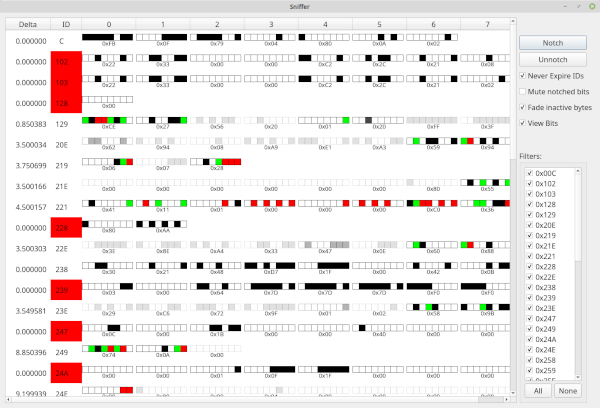

Sniffer Window
=================

Using the Sniffer Window
=========================

This window is essentially a turbo charged graphical version of the linux 
can_utils program "cansniffer". The general idea here is to display a list 
of frames such that you only see frames that are actively updating. If a given 
ID has not been seen in 5 seconds the ID portion will turn RED and then disappear
from the list. In this way only frames that are updating are in the list. They are
ordered by ID. Bytes that have decremented will be red and bytes that have incremented 
will be green. You can use the "Filters" area to mask away some IDs so that they never 
show up. This can help to declutter the list. 

This window updates with a 200ms interval.

Notching and Unnotching
========================

While the window is running it keeps a running list each 200ms cycle of all the bits that 
changed in that timespan. Each 200ms this list is backed up and reset. If you push the 
notch button the system will remember all the bits that were set in the last 200ms window 
and will not color the output if those bits are toggled in the future. They will thus somewhat 
be ignored except that you can visually still see them updating. If you click the Notch 
button repeatedly it will add any new changed bits to the old changed bits. In this way you 
can build up a set of bits to ignore. Un-notching causes all notched (ignored) bits to be 
reset and thus all changes will be colored once again. Notching is used to ignore bits that are changing all of the time. Why do this? The biggest reason is that you will probably want to ignore the "steady state" when you are doing research. Here is an example: Let's say you are searching for the steering position in your car. If you aren't moving the steering wheel you could safely assume that the value is not changing either. So, you might notch several times to mask out all the changing bits. You know anything currently changing isn't steering angle because you aren't moving the steering wheel. So, after thoroughly notching you then move the steeering wheel and see if you can spot an ID where suddenly bits changed where they weren't before. This can also be used to find gear selectors, speed and tachometer values, etc. Keep in mind that the default behavior when bits are notched is to still update but no longer change color. You can change this (see below)

Advanced Options
==================

All of the above was valid if you do not check any of the four checkboxes. With the checkboxes
unchecked this window is very close to cansniffer on the command line. But, what fun is that?
These checkboxes modify the way the window works in a variety of ways.

Never Expire IDs
==================

This checkbox will do exactly what it says on the tin. Instead of frame ID's expiring after
5 seconds of inactivity they will stick around forever. This can be useful so that the ID you
are watching doesn't jump up and down as IDs expire and potentially come back later on or new IDs
are seen. With no expiration you will get a more consistent view of the IDs. You are still free
to filter away IDs you are not interested in.

Mute notched bits
===================

This checkbox might sound a bit strange. With this checked any bytes that you have notched will
ignore any notched bits and not even change the display to update if only notched bits were changed.
This completely hides all notched data. The view of the frames will then NOT perfectly or correctly
represent the actual most up to date data for each ID. So, use this option with caution. But, it
is handy when you are looking for a needle in a haystack and you don't want things changing if you've
already told the program to notch them away. This will make changes even more visible but you must be cautious since the data is now somewhat "fake" anywhere there are notched bits.

Fade inactive bytes
====================

This can be used with mute or without but has a similar purpose. When this is checked any bytes
that haven't updated recently will begin to fade away to white. They never quite get all the way
to disappearing but will fade to be very light. In this way only data which is actively changing will
be very visible. This drastically aids in helping you to ignore any bytes that are not changing.

View Bits
==========

This option changes the view very starkly. This is the view shown in the picture associated with this topic. When View Bits is selected the display will change to show each bit within the bytes as separate blocks that each can separately be black when set and unchanged, white when unset and unchanged, red when freshly unset, and green when freshly set. This allows for a very fine grained view. Fade inactive, and never expire still work as usual. This mode might be a bit "busy" and lowers the number of IDs you can see at once. But, the choice is yours. You give up some density in exchange for verbosity.
