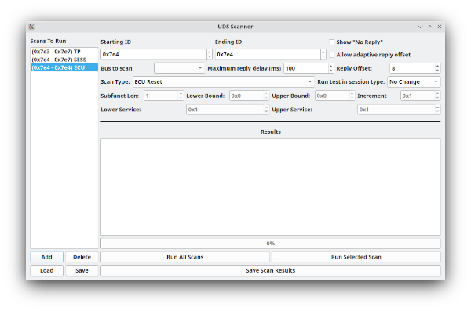

UDS Scan Window
=================

Purpose of the UDS Scan Window
===============================

This is essentially another CAN fuzzing window but a very special one. This window is meant to search for UDS compliant (or nearly compliant) nodes on the CAN bus. It can also be used to do a blanket search for services, sub functions, and data items on a known UDS node.

Using the UDS Scan Window
==========================

UDS queries are sent out on the bus from "Starting ID" to "Ending ID". Usually UDS compliant ECUs will respond to 0x7E0 through 0x7E7 which is why those are the defaults. Some vehicles use UDS "like" protocols on other IDs. Usually UDS nodes reply with an ID 8 higher than the request ID. This is thus the default in the program. However, some nodes cheat and do not do this. It is quite common for responses to come from an address 16 higher instead. Sometimes the reply address has no resemblance to the listening address. To deal with this situation there is a checkbox "Allow adaptive reply offset." If this is checked then replies will be accepted no matter what address they come from. Deselecting this will cause only replies of the proper offset to be accepted. The offset defaults to 8 but can be changed with the "Reply Offset" selector. Additionally, you can select which bus to scan and set how long you want to wait for replies. 

"Show tests with no Replies" - This checkbox does what it says. It is a personal preference whether you'd like to see an entry in the list for scans that returned no results. Sometimes an ECU will just plain ignore messages it doesn't like. In that case you have the option to see an entry in the list telling you that the message was ignored or whether you'd prefer to reduce clutter and just skip anything that had no reply.

You need to also set a type of scan to do. You can select more than one type but if you don't set any then you aren't going to see any results. Keep that in mind as none are checked by default.

"Read By ID" - UDS allows one to read data from the ECU by an ID number. These are not defined anywhere and are custom to each ECU. But, you can use this to scan a range of IDs to see if you get a response to any of them. There is no real standard for how many bytes the ID will be. It could be 1, it could be 2, 3, 4. It's likely to be around 2. You can set the number of subfunction bytes which will set the size of the ID. Then you can set the upper and lower bound to scan.

"Read By Addr" - You can also read data by address. Like IDs the address could be different sizes depending on the hardware you are querying. This works the same as reading by ID but by address instead.

"Session Ctrl" - UDS has the concept of session type. Some types are "normal" "extended diagnostics" "programming". Scanning for session type will try them all and let you know which the device supports. However, note that you might get a response that indicates that conditions are not correct or that access was denied. This probably means that the mode is actually supported but you'd have to do the right things first. This is still useful information. This scan window is too simple to use for further cracking of such things but the scripting interface is the perfect thing to use instead. 

"ECU Reset" - The ECU might also support being reset by a UDS message. This scan type will try the various reset types and see which are supported.

"Security Access" - When a device is first started and normally operating it will generally not allow you to do potentially dangerous or sensitive operations such as downloading firmware or changing parameters. To do these things you need to enter a different security level. The security access mechanism is used for this. There are a few different security levels that are likely to be supported. This scan type will attempt to find security levels and see if they are protected or not. That is, unfortunately for the casual cracker, most of the time the elevate security levels will be protected by a challenge/response system. The ECU will send you a challenge in the form of one or more random looking bytes. You are tasked with returning the proper response for those challenge bytes. You generally don't have very many guesses before your hands are slapped. Sometimes the C/R is actually fixed and you can just capture valid traffic once and then use the same response forever. Sometimes the C/R is stupidly easy or there are only a couple of different possible answers. Sometimes the ECU developer actually took more than 2 seconds to implement these features and your work will be cut out for you. This scan type will find which levels the ECU seems to support but is unlikely to actually unlock them.

"Tester Present" - A scan that tries to see if tester present is supported. It almost certainly is. This scan can be used to sweep a wide range of addresses just to narrow down the list of addresses to scan more thoroughly. Normally tester present is sent periodically by a connected device just to let the ECU know that someone is still there.

"Wildcard" - Allows for you to set a lower and upper range for the service byte as well as the number of subfunction bytes and the range there as well. This allows for UDS fuzzing by shooting the moon and trying a huge range of traffic just to see what is supported and what isn't. This test can take a VERY long time if you aren't careful but will thoroughly determine what the ECU will support and what it won't.
